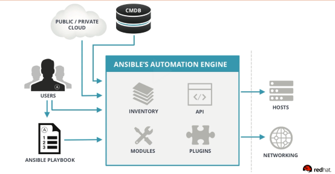

# Ansible


## 百度百科

ansible是新出现的自动化运维工具，基于Python开发，集合了众多运维工具（puppet、cfengine、chef、func、fabric）的优点，实现了批量系统配置、批量程序部署、批量运行命令等功能。

Ansible是一种IT自动化工具。它可以帮助我们批量配置系统，部署软件以及协调更高级的IT任务，例如连续部署或零停机滚动更新。

Ansible的主要目标是让工作变得简单和易操作，它同时也非常关注安全性和可靠性，传输过程是基于openssh来实现的，保证了传输的数据的安全性！大大降低安全风险！


## Ansible的特点

Ansible采用无代理方式（agentless）管理机器，因为Ansible的通信是通过openssh来实现的，所以你无需考虑如何远程升级受管机器的代理程序！只要可以保证openssh可以正常通信即可！因为现在几乎所有的Linux平台都自带了openssh，Ansible在部署阶段无需考虑在远程机器上安装客户端软件！这样极大的减少了前期部署的工作！

Ansible有丰富的模块可以让你直接使用，当然在Ansible的社区也有很多优秀的开发者在贡献新的模块，所以你总会找到适合自己的模块，当然你也可以自己开发模块！

Ansible是使用python开发，所以关于Ansible的二次开发和模块开发成本相对较低


## Ansible的工作流程




## Ansible的基本概念

- 控制节点

  任何装有Ansible的机器都可以叫做控制节点。您可以从任何控制节点调用/usr/bin/ansible执行一条任务，或执行/usr/bin/ansible-playbook命令读取剧本执行多个任务

- 受管节点

  使用Ansible管理的的网络设备和服务器，都可以叫做受管节点！受管节点有时也可以叫做“主机“，受管节点无需安装ansible

- 清单

  受管节点的列表。Ansible在管理某个节点前，需要先将节点添加到清单文件中！清单文件有时也称为“主机清单文件”。清单文件可以为每个受管节点指定信息，例如IP地址、端口等信息！也可以把主机分成主机组管理！ 

- 模块

  Ansibe执行代码的单位。Ansible自带了很多模块，每个模块都有特定的用途。我们可以通过任务调用单个模块，例如shell模块，可以调用shell命令在管理主机执行。

- 任务

  Ansible执行的单位，可以使用临时命令一次执行一个任务

- 剧本

  任务的有序列表文件，所以我们可以重复读取剧本文件重复运行剧本内的任务！这个是我们执行任务的主要方式


## Ansible的安装

Ansible要求主机上有Python2.7或者python3.5以上的环境，控制节点不支持 WIndows 平台

centos 6安装，需要先安装 epel-release 源，才可以安装 ansible

```mysql
yum -y install epel-release
yum -y install ansible
```

centos 7安装，ansible 的安装包已经加入 yum 的 base 源中，直接使用 yum 安装

```mysq;
yum -y install ansible
```

分发公钥，免密钥登录

```mysql
ssh-keygen
ssh-copy-id root@10.0.0.11
```

编辑主机清单文件

```mysql
vim /etc/ansible/hosts

13 [henry]	#组名
14 10.0.0.11
15 10.0.0.12

或
13 [henry]	#组名
14 10.0.0.1[1:2]
```

测试

```mysql
ansible henry -a "ip a"

10.0.0.11 | CHANGED | rc=0 >>
1: lo: <LOOPBACK,UP,LOWER_UP> mtu 65536 qdisc noqueue state UNKNOWN 
    link/loopback 00:00:00:00:00:00 brd 00:00:00:00:00:00
    inet 127.0.0.1/8 scope host lo
    inet6 ::1/128 scope host 
       valid_lft forever preferred_lft forever
2: eth0: <BROADCAST,MULTICAST,UP,LOWER_UP> mtu 1500 qdisc pfifo_fast state UP qlen 1000
    link/ether 00:0c:29:e1:14:9e brd ff:ff:ff:ff:ff:ff
    inet 10.0.0.11/24 brd 10.0.0.255 scope global eth0
    inet6 fe80::20c:29ff:fee1:149e/64 scope link 
       valid_lft forever preferred_lft forever
```


## Ansible常用模块

ping

用来检查目标主机是否在线

```mysql
ansible henry -m ping

10.0.0.11 | SUCCESS => {
    "ansible_facts": {
        "discovered_interpreter_python": "/usr/bin/python"
    }, 
    "changed": false, 
    "ping": "pong"
}
```

yum

用来在Centos系统上使用yum命令安装软件包

选项：

​	name：指定安装包的名字

​	state：latest 安装最新版 present 安装默认版 installed 安装 absent 卸载

​	removed：卸载

```mysql
ansible henry -m yum -a 'name=httpd state=present'

10.0.0.11 | CHANGED => {
    "ansible_facts": {
        "discovered_interpreter_python": "/usr/bin/python"
    }, 
    "changed": true, 
    "changes": {
        "installed": [
            "httpd"
        ]
```

command

command模块用来执行系统命令，但是不支持shell下的特殊符号 如：|  &&等

```mysql
ansible henry -m command -a 'echo aaa'

10.0.0.11 | CHANGED | rc=0 >>
aaa
```

shell

shell模块和command模块使用方法基本一致，但是他可以支持shell的特殊符号，如： |  && 等

```mysql
ansible henry -m shell -a "cd /opt/ && touch ccc && ls /opt"

10.0.0.11 | CHANGED | rc=0 >>
ccc
rh
```

service

用来管理centos上的服务的启动、关闭、重启和重载

选项：

​	name： 服务名字

​	state：  started(启动)  stopped(停止) restarted(重启)  reloaded(重载)

​	enabled： 默认是no，将服务设置为开机自启

```mysql
ansible henry -m service -a "name=httpd state=started"

10.0.0.11 | CHANGED => {
    "ansible_facts": {
        "discovered_interpreter_python": "/usr/bin/python"
    }, 
    "changed": true, 
    "name": "httpd", 
    "state": "started"
}
```

file

用来创建文件、目录、链接文件

选项：

​	group：定义文件/目录的属组 

​	mode：定义文件/目录的权限 

​	owner：定义文件/目录的属主 

​	path：必选项，定义文件/目录的路径 

​	recurse：递归的设置文件的属性，只对目录有效 

​	src：要被链接的源文件的路径，只应用于state=link的情况 

​	dest：被链接到的路径，只应用于state=link的情况

​	state：

​		directory：如果目录不存在，创建目录 

​		file：即使文件不存在，也不会被创建 

​		link：创建软链接 

​		hard：创建硬链接 

​		touch：如果文件不存在，则会创建一个新的文件，如果文件或目录已存在，则更新其最后修改时间 

​		absent：删除目录、文件或者取消链接文件

```mysql
ansible webserver -m file -a "src=/etc/ssh/sshd_config dest=/opt/c.sh state=link"

10.0.0.11 | CHANGED => {
    "ansible_facts": {
        "discovered_interpreter_python": "/usr/bin/python"
    }, 
    "changed": true, 
    "dest": "/opt/c.sh", 
    "gid": 0, 
    "group": "root", 
    "mode": "0777", 
    "owner": "root", 
    "size": 20, 
    "src": "/etc/ssh/sshd_config", 
    "state": "link", 
    "uid": 0
}
```

user

创建用户

选项：

​	home： 指定创建的家目录

​	groups：指定用户组

​	uid：指定UID

​	password：设置密码，密码必须是密文

​	name：创建的用户名字

​	createhome：是否创建家目录(yes/no)

​	state:  是创建还是删除。（present，absent），默认是创建

​	shell： 指定用户登录的shell环境

​	remove：删除用户家目录，默认为no

```mysql
ansible webserver -m user -a "name=tom password=tom"

properly.

10.0.0.11 | CHANGED => {
    "ansible_facts": {
        "discovered_interpreter_python": "/usr/bin/python"
    }, 
    "changed": true, 
    "comment": "", 
    "create_home": true, 
    "group": 500, 
    "home": "/home/********", 
    "name": "VALUE_SPECIFIED_IN_NO_LOG_PARAMETER", 
    "password": "NOT_LOGGING_PASSWORD", 
    "shell": "/bin/bash", 
    "state": "present", 
    "system": false, 
    "uid": 500
}
```

group

创建用户组

选项：

​	gid：指定用的gid。 

​	name：指定用户名。 

​	state：是创建还是删除。（present，absent） 

```mysql
ansible webserver -m group -a "name=mike"

10.0.0.11 | CHANGED => {
    "ansible_facts": {
        "discovered_interpreter_python": "/usr/bin/python"
    }, 
    "changed": true, 
    "gid": 501, 
    "name": "mike", 
    "state": "present", 
    "system": false
}
```

copy

用来复制文件至目标主机

选项：

​	src：文件在管理主机的据对路径或者相对路径

​	dest：将文件复制到目标主机的路径

​	backup：是否将目标主机的同名文件备份，默认为no

​	mode: 授权

​	directory_mode：递归授权

```mysql
ansible  webserver  -m copy  -a 'src=/root/nginx.sh  dest=/opt/'

10.0.0.11 | CHANGED => {
    "ansible_facts": {
        "discovered_interpreter_python": "/usr/bin/python"
    }, 
    "changed": true, 
    "checksum": "da39a3ee5e6b4b0d3255bfef95601890afd80709", 
    "dest": "/opt/nginx.sh", 
    "gid": 0, 
    "group": "root", 
    "md5sum": "d41d8cd98f00b204e9800998ecf8427e", 
    "mode": "0644", 
    "owner": "root", 
    "secontext": "system_u:object_r:usr_t:s0", 
    "size": 0, 
    "src": "/root/.ansible/tmp/ansible-tmp-1575064068.35-189973456316605/source", 
    "state": "file", 
    "uid": 0
}
```

unarchive

用来解压文件

选项：

​	copy：在解压文件之前，是否先将文件复制到远程主机，默认为yes。若为no，则要求目标主机上压缩包必须存在

​	creates：指定一个文件名，当该文件存在时，则解压指令不执行

​	dest：远程主机上的一个路径，即文件解压的绝对路径。

​	group：解压后的目录或文件的属组

​	mode：解压后文件的权限

​	src：如果copy为yes，则需要指定压缩文件的源路径

​	owner：解压后文件或目录的属主

```mysql
ansible webserver -m unarchive -a "src=nginx-1.12.0.tar.gz dest=/opt/"

10.0.0.11 | CHANGED => {
    "ansible_facts": {
        "discovered_interpreter_python": "/usr/bin/python"
    }, 
    "changed": true, 
    "dest": "/opt/", 
    "extract_results": {
        "cmd": [
            "/bin/gtar", 
            "--extract", 
            "-C", 
            "/opt/", 
            "-z", 
            "-f", 
            "/root/.ansible/tmp/ansible-tmp-1575065835.74-51483025197905/source"
        ], 
        "err": "", 
        "out": "", 
        "rc": 0
    }, 
    "gid": 0, 
    "group": "root", 
    "handler": "TgzArchive", 
    "mode": "0755", 
    "owner": "root", 
    "secontext": "system_u:object_r:usr_t:s0", 
    "size": 4096, 
    "src": "/root/.ansible/tmp/ansible-tmp-1575065835.74-51483025197905/source", 
    "state": "directory", 
    "uid": 0
}
```

get_url

用于从http、ftp、https服务器上下载文件

选项：

​	url：指定要下载文件的 url 路径

```shell
ansible webservers -m get_url -a "url=http://nginx.org/download/nginx-1.15.7.tar.gz dest=/opt/"

10.0.0.11 | CHANGED => {
    "ansible_facts": {
        "discovered_interpreter_python": "/usr/bin/python"
    }, 
    "changed": true, 
    "checksum_dest": null, 
    "checksum_src": "48c59c35655b06c6e5ce736a3d5f34b17a2e6551", 
    "dest": "/opt/nginx-1.15.7.tar.gz", 
    "elapsed": 8, 
    "gid": 0, 
    "group": "root", 
    "md5sum": "719b2e3d416f111fecc9db6625553658", 
    "mode": "0644", 
    "msg": "OK (1026732 bytes)", 
    "owner": "root", 
    "secontext": "system_u:object_r:usr_t:s0", 
    "size": 1026732, 
    "src": "/root/.ansible/tmp/ansible-tmp-1575235825.6-145082415668271/tmpOCX3S0", 
    "state": "file", 
    "status_code": 200, 
    "uid": 0, 
    "url": "http://nginx.org/download/nginx-1.15.7.tar.gz"
}
```

synchronize

使用 rsync 同步文件，将主控方目录推送到指定节点的目录下,使用此模块需要先安装 rsync

选项：

​	delete： 删除不存在的文件，delete=yes 使两边的内容一样（即以推送方为主），默认no 

​	src： 要同步到目的地的源主机上的路径; 路径可以是绝对的或相对的。如果路径使用”/”来结尾，则只复制目录里的内容，如果没有使用”/”来结尾，则包含目录在内的整个内容全部复制 

​	dest：目的地主机上将与源同步的路径; 路径可以是绝对的或相对的。 

​	dest_port：默认目录主机上的端口 ，默认是22，走的ssh协议。 

​	mode: push或pull，默认push，一般用于从本机向远程主机上传文件，pull 模式用于从远程主机上取文件。 

​	rsync_opts：通过传递数组来指定其他rsync选项。

```shell
ansible webservers -m synchronize -a "src=/opt/ dest=/opt/ delete=no"

10.0.0.11 | CHANGED => {
    "changed": true, 
    "cmd": "/usr/bin/rsync --delay-updates -F --compress --archive --rsh=/usr/bin/ssh -S none -o StrictHostKeyChecking=no -o UserKnownHostsFile=/dev/null --out-format=<<CHANGED>>%i %n%L /opt/ 10.0.0.11:/opt/", 
    "msg": ".d..t...... ./\n<f+++++++++ bbb\n", 
    "rc": 0, 
    "stdout_lines": [
        ".d..t...... ./", 
        "<f+++++++++ bbb"
    ]
}
```

fetch

fetch模块它用于从远程机器获取文件，并将其本地存储在由主机名组织的文件树中

选项：

​	src：远程系统上要获取的文件。 这必须是一个文件，而不是一个目录。 后续版本可能会支持递归提取。 

​	dest：保存文件的目录

```shell
ansible webservers -m fetch -a "src=/opt/aaa dest=/root/"

10.0.0.11 | CHANGED => {
    "changed": true, 
    "checksum": "da39a3ee5e6b4b0d3255bfef95601890afd80709", 
    "dest": "/root/10.0.0.11/opt/aaa", 
    "md5sum": "d41d8cd98f00b204e9800998ecf8427e", 
    "remote_checksum": "da39a3ee5e6b4b0d3255bfef95601890afd80709", 
    "remote_md5sum": null
}
```

setup

用于收集远程主机的一些基本信息。

选项：

​	filter参数：用于进行条件过滤。如果设置，仅返回匹配过滤条件的信息。

​	常用的过滤关键词：

​		ansible_all_ipv4_addresses：仅显示ipv4的信息

​		ansible_devices：仅显示磁盘设备信息

​		ansible_distribution：显示是什么系统，例：centos,suse等

​		ansible_distribution_major_version：显示是系统主版本

​		ansible_distribution_version：仅显示系统版本

​		ansible_machine：显示系统类型，例：32位，还是64位

​		ansible_eth0：仅显示eth0的信息

​		ansible_hostname：仅显示主机名

​		ansible_kernel：仅显示内核版本

​		ansible_lvm：显示lvm相关信息

​		ansible_memtotal_mb：显示系统总内存

​		ansible_memfree_mb：显示可用系统内存

​		ansible_memory_mb：详细显示内存情况

​		ansible_swaptotal_mb：显示总的swap内存

​		ansible_swapfree_mb：显示swap内存的可用内存

​		ansible_mounts：显示系统磁盘挂载情况

​		ansible_processor：显示cpu个数(具体显示每个cpu的型号)

​		ansible_processor_vcpus：显示cpu个数(只显示总的个数)

​		ansible_python_version：显示python版本

```shell
ansible webservers -m setup -a "filter=ansible_hostname"

10.0.0.11 | SUCCESS => {
    "ansible_facts": {
        "ansible_hostname": "Fp-01", 
        "discovered_interpreter_python": "/usr/bin/python"
    }, 
    "changed": false
}
```

