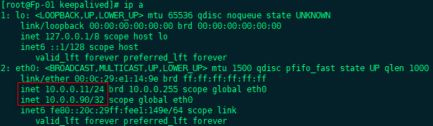
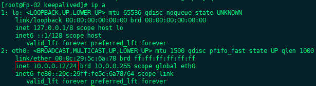
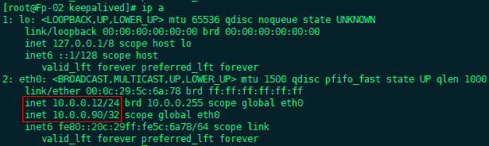

# MySQL


## 百度百科

MySQL：关系型数据库管理系统，由瑞典MySQL AB公司开发，目前属于 Oracle 旗下产品。MySQL 是最流行的关系型数据库管理系统之一，在 Web 应用方面，MySQL 是最好的应用软件之一

MySQL 所使用的 SQL 语言是用于访问数据库的最常用标准语言，由于体积小、速度快、总体拥有成本低，尤其是开放源码这一特点，一般的中小型网站的开发都选择 MySQL 作为网站数据库

MySQL 软件采用了双授权政策，分为社区版和商业版，其中社区版的性能卓越，搭配 PHP 和 Apache 可组成良好的开发环境

与其他的大型数据库，例如 Oracle、DB2、SQL server 等相比较，MySQL 自有它的不足之处，但是这丝毫不影响他的受欢迎程度，对于一般的个人使用者和中小型企业来说，MySQL 提供的功能已经绰绰有余，而且由于 MySQL 是开放源代码软件，因此可以大大降低总体拥有成本

Linux 作为操作系统，Aaache 或 Nginx 作为 Web 服务器，MySQL 作为数据库，PHP、pert、python 作为服务端的脚本解释器，由于这是个软件都是免费或者是开放源代码软件，音系使用这种方式不用花一分钱（除开支人工成本）就可以建立起一个稳定的、免费的网站系统，被业界称之为 “LAMP” 或 “LNMP” 组合。


## 源码安装

上传源码包至服务器

```mysql
tar -zxvf mysql-5.6.45.tar.gz
cd mysql-5.6.45
```

安装所需的依赖

```mysql
yum -y install ncurses-devel libaio-devel
```

编译 && 编译安装

```mysq;
cmake .
make && make install
```

创建 MySQL 用户

```mysql
useradd mysql
```

修改属主、属组

```mysql
chown -R mysql.mysql /usr/local/mysql
cd /usr/local/mysql/scripts/
./mysql_install_db --user=mysql --basedir=/usr/local/mysql/ --datadir=/usr/local/mysql/data/
```

给 MySQL 提供配置文件

```mysql
cd /usr/local/mysql/support-files/
cp my-default.cnf /etc/my.cnf 
cp mysql.server /etc/rc.d/init.d/mysqld
```

启动 MySQL

```mysql 
service mysqld start
```

做软连接

```mysql
ln -s /usr/local/mysql/bin/* /usr/local/bin/
```

给 MySQL 设置密码

1. 命令行

   ```
   mysqladmin -u root password "新密码"
   ```

2. MySQL

   ```mysql
   set password = password("123");
   ```


## MySQL 优化

```mysql
mysql_secure_installation

Enter current password for root (enter for none): 	#输入根用户的当前密码（输入表示无）

Set root password? [Y/n]    #是否设置root用户密码，输入y并回车或直接回车
New password:               #设置root用户的密码
Re-enter new password:      #再输入一次你设置的密码
Password updated successfully!
Reloading privilege tables..
… Success!

Remove anonymous users? [Y/n]   #是否删除匿名用户,生产环境建议删除，所以直接回车
… Success!

Disallow root login remotely? [Y/n] #是否禁止root远程登录,根据自己的需求选择Y/n并回车,建议禁止
… Success!

Remove test database and access to it? [Y/n] #是否删除test数据库,直接回车
- Dropping test database…
… Success!

Reload privilege tables now? [Y/n] #是否重新加载权限表，直接回车
… Success!
Cleaning up…
Thanks for using MySQL!
```


## 主从搭建

修改主 MySQL 配置文件

```mysql
vim /etc/my.cnf 

 2 
 3 server-id=1
 4 log-bin=mysql-bin
 5 
```

重启主 MySQL 服务

```mysql
service mysqld restart
```

进入主 MySQL，授权

```mysql
mysql> grant replication slave on *.* to 'tom'@'10.0.0.%' identified by '123';
Query OK, 0 rows affected (0.00 sec)

mysql> flush privileges;
Query OK, 0 rows affected (0.00 sec)
```

修改从 MySQL 配置文件

```mysql
vim /etc/my.cnf 

 2 
 3 server-id=2
 4 relay-log=mysql-relay
 5 
```

重启主 MySQL 服务

```mysql
service mysqld restart
```

进入从 MySQL，授权

```mysql
mysql> stop slave;
Query OK, 0 rows affected, 1 warning (0.00 sec)

mysql> change master to
    -> master_host='10.0.0.11',
    -> master_user='tom',
    -> master_password='123',
    -> master_log_file='mysql-bin.000003',
    -> master_log_pos=326;
Query OK, 0 rows affected (0.03 sec)

mysql> start slave;
Query OK, 0 rows affected (0.00 sec)
```

查看从 MySQL 状态

```mysql
mysql> show slave status\G;
*************************** 1. row ***************************
               Slave_IO_State: Waiting for master to send event
                  Master_Host: 10.0.0.11
                  Master_User: tom
                  Master_Port: 3306
                Connect_Retry: 60
              Master_Log_File: mysql-bin.000003
          Read_Master_Log_Pos: 326
               Relay_Log_File: mysql-relay.000002
                Relay_Log_Pos: 251
        Relay_Master_Log_File: mysql-bin.000003
             Slave_IO_Running: Yes
            Slave_SQL_Running: Yes
```

IO 与 SQL 运行都为 YES，即为主从搭建成功


## MySQL + KeepaLived 高可用

### 1.  基础环境

两台服务器，MySQL互为主从

MASTER 的 IP：10.0.0.11

BACKUP 的 IP：10.0.0.12

### 2. MASTER 实操

```shell
yum -y install keepalived 
cd /etc/keepalived
cp keepalived.conf keepalived.conf.bak
vim keepalived.conf
```

```shell
vrrp_instance VI_1 {
    state MASTER	       	# 主机的初始身份：MASTER/BACKUP
    interface eth0       	# VIP绑定网卡设备
    virtual_router_id 51    # 路由广播ID，同步ID可以接受广播
    priority 100            # 优先级，越大优先级越高，主的初始优先级必须要大于备份的主机
    advert_int 1
    authentication {
        auth_type PASS
        auth_pass 1111
    }
    virtual_ipaddress {
        10.0.0.90      # VIP地址
    }
}
virtual_server 10.0.0.90 3306 {      # 虚拟服务器，IP地址是VIP，端口是对应服务的端口
    delay_loop 6
    nat_mask 255.255.255.0
    protocol TCP

    real_server 10.0.0.11 3306 {      # 真实服务器的ip和端口
        weight 1
        notify_down  /tmp/kill.sh           # 检测到down状态时要执行的脚本，内容为停止keepalived
        TCP_CHECK {   							# 健康检查模块，通过TCP检查
            connect_port 3306     				# TCP要检查的端口
            connect_timeout 3  					# 超时时间
            nb_get_retry 3   					# 重试次数
            delay_before_retry 3    		   # 检查轮询周期时间
        }
    }
}
```

配置文件结束，保存退出

创建脚本

```shell
vim /tmp/kill.sh 
```

```shell
#!/bin/bash
service keepalived stop
```

重启 keepalived  服务

```sh
service keepalived restart 
```

查看 VIP 是否生成

```shell
ip a
```



### 3. BACKUP 实操

```shell
yum -y install keepalived 
cd /etc/keepalived
cp keepalived.conf keepalived.conf.bak
vim keepalived.conf
```

```shell
vrrp_instance VI_1 {
    state BACKIP	       	# 主机的初始身份：MASTER/BACKUP
    interface eth0       	# VIP绑定网卡设备
    virtual_router_id 51    # 路由广播ID，同步ID可以接受广播
    priority 90            # 优先级，越大优先级越高，主的初始优先级必须要大于备份的主机
    advert_int 1
    authentication {
        auth_type PASS
        auth_pass 1111
    }
    virtual_ipaddress {
        10.0.0.90      # VIP地址
    }
}
virtual_server 10.0.0.90 3306 {      # 虚拟服务器，IP地址是VIP，端口是对应服务的端口
    delay_loop 6
    nat_mask 255.255.255.0
    protocol TCP

    real_server 10.0.0.12 3306 {      # 真实服务器的ip和端口
        weight 1
        notify_down  /tmp/kill.sh           # 检测到down状态时要执行的脚本，内容为停止keepalived
        TCP_CHECK {   							# 健康检查模块，通过TCP检查
            connect_port 3306     				# TCP要检查的端口
            connect_timeout 3  					# 超时时间
            nb_get_retry 3   					# 重试次数
            delay_before_retry 3    		   # 检查轮询周期时间
        }
    }
}
```

配置文件结束，保存退出

创建脚本

```shell
vim /tmp/kill.sh 
```

```shell
#!/bin/bash
service keepalived stop
```

重启 keepalived  服务

```sh
service keepalived restart 
```

查看 VIP 是否生成

```shell
ip a
```



### 4. 高可用测试

master 服务器上启动 MySQL keepalived

```shell
service mysql restart
service keepalived restart
```


此时表示 master 服务器正在正常使用

```
service mysql stop
```

MySQL 停止，代表服务器宕机，此时去查看 Backup 的 IP



master 的 IP，已经漂浮到了 Backup 上，此时，Backup 是主


## MySQL 二进制日志恢复数据

​	MySQL 的二进制文件会存储 MySQL 数据库中的增删改的操作命令，我们可以在数据丢失后利用二进制文件恢复

```mysql
cd /var/lib/mysql
mysqlbinlog mysql-bin.000003

/*!*/;
# at 251
#191122  9:45:18 （起始时间）server id 1  end_log_pos 326 	Query	thread_id=2	exec_time=0	error_code=0
SET TIMESTAMP=1574387118/*!*/;
flush privileges
/*!*/;
# at 326  （起始位置）
#191122 10:29:40 （终止位置）server id 1  end_log_pos 407 （终止位置） Query	thread_id=4	exec_time=0	error_code=0
SET TIMESTAMP=1574389780/*!*/;
create database aaa
/*!*/;
DELIMITER ;
# End of log file
ROLLBACK /* added by mysqlbinlog */;
/*!50003 SET COMPLETION_TYPE=@OLD_COMPLETION_TYPE*/;
```

### 1.按时间恢复

```mysql
mysqllogbin --start-positon=326 --stop-position 407 mysql-bin.000003
```

### 2.按位置恢复

```mysql
mysqllogbin --start-datetime=“2019-11-22 9:45:18” --stop-datetime=“2019-11-22 10:29:40” mysql-bin.000003
```


## MySQLdump

### 1.备份

```mysql
mysqldump -uroot -p -B aaa > /tmp/aaa.sql
```

### 2.恢复

```mysql
mysql -u root -p < /tmp/aaa.sql
```